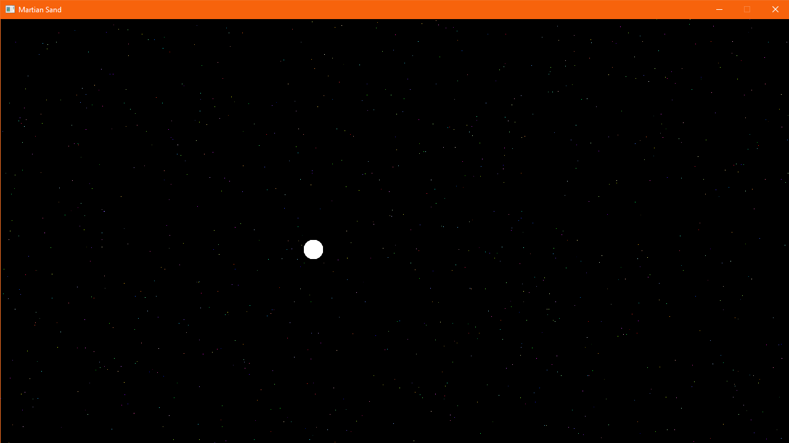

# Martian Sand Journal

## Day 1

Rust is hard. I seem to forget every time.

The first day mainly consisted of getting the window set up, being able to draw pixels to the screen.

At first, it was completely random colours, followed by specifically setting each pixel to a random shade of grey.

Eventually, I set up a `Vec` of cells, which contain `x` and `y` positions, so those specific pixels could be drawn. It turns out that doing it that way then requires you to clear the screen upon redraw, and I found a way that let me do so in a completely parallel way, saving an immense amount of rendering time.

After that, I kept track of the mouse position, as well as how long the last frame took to render. I draw a little bar in the top corner depending on the game's speed, and drew a box where the mouse cursor was located. This drawing code was getting messy and very repetitive, so the next logical step was to abstract the drawing process into a separate file.

Finally, the last piece of the puzzle for the day had me look at creating a circle drawing function. Thanks to the handy dandy Pythagorean theorem I could determine whether a given pixel was within a circle's radius, at which point I would draw a pixel in that position.

Tomorrow, I would like to be able to draw cells/elements to the screen, and maybe look at rendering text? It's likely I'll need an external library for the latter...

The following day, I plan on researching fluid mechanics a little closer, so I can figure out how on earth the cells are going to interact with each other. That, and re-learning Rust are the two main reasons for this endeavour.

Last commit of the day: 5a792cd
