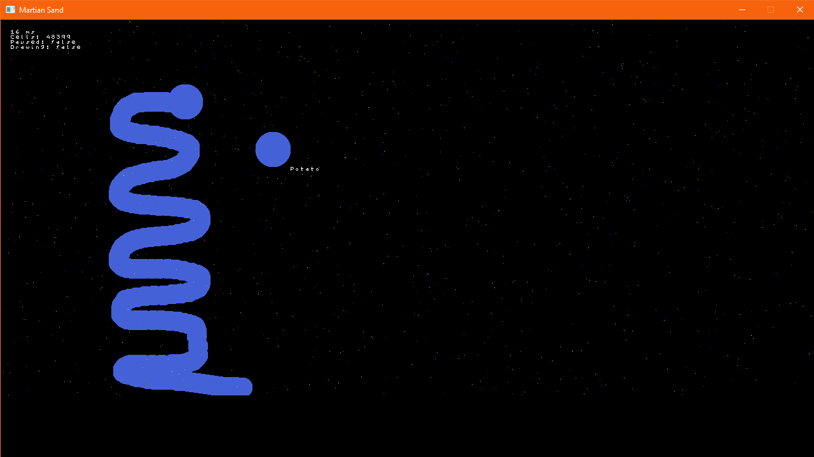

# Martian Sand Journal

## Day 1

Rust is hard. I seem to forget every time.

The first day mainly consisted of getting the window set up, being able to draw pixels to the screen.

At first, it was completely random colours, followed by specifically setting each pixel to a random shade of grey.

Eventually, I set up a `Vec` of cells, which contain `x` and `y` positions, so those specific pixels could be drawn. It turns out that doing it that way then requires you to clear the screen upon redraw, and I found a way that let me do so in a completely parallel way, saving an immense amount of rendering time.

After that, I kept track of the mouse position, as well as how long the last frame took to render. I draw a little bar in the top corner depending on the game's speed, and drew a box where the mouse cursor was located. This drawing code was getting messy and very repetitive, so the next logical step was to abstract the drawing process into a separate file.

Finally, the last piece of the puzzle for the day had me look at creating a circle drawing function. Thanks to the handy dandy Pythagorean theorem I could determine whether a given pixel was within a circle's radius, at which point I would draw a pixel in that position.

Tomorrow, I would like to be able to draw cells/elements to the screen, and maybe look at rendering text? It's likely I'll need an external library for the latter...

The following day, I plan on researching fluid mechanics a little closer, so I can figure out how on earth the cells are going to interact with each other. That, and re-learning Rust are the two main reasons for this endeavour.

Last commit of the day: 5a792cd

## Day 2

Today the first thing I set out to do was figure out a way to draw text to the screen. I came across a term called "bit blitting", which is a method of blending pixels together using binary operations. After this, I searched for the term "blit font" online, and immediately found a project whereby an ASCII font had been created using entirely 32-bit integers, and through the use of bit shifting they were able to convert any pixels where the bit at that position was set to `1`.

The process of converting this font into Rust was not an easy endeavour, _purely_ based on my lack of recent experience with Rust, and also the fact that, despite having learned what bit shifting was at university, I've never actually had to use it. Once I'd figured out how many bits were needed to shift, and how to use a bit-mask using the `AND` operator, it was all sussed.

After some helper functions had been written, any arbitrary ASCII text could be drawn to the screen!

My second goal for the day was to be able to add cells to the world, and this was achieved by adding cells to every pixel within a circle around the mouse cursor, as long as an existing cell was not there.

At first, this became incredibly slow as more cells were added, as it was checking every single cell previously added to make sure it did not collide. My first thought was to parallelise the search, as it's _incredibly_ easy to do so in Rust. The outcome was a slight performance increase, however I realised it could be optimised further. Instead of checking every single cell, it first determines whether a given pixel is colliding with the circle. If not, move to the next pixel. Assuming that pixel _is_ within the circle, it collects each cell's position within the square bounding box of the circle, which is done is parallel, and _then_ we search each cell within that box. This means it's checking a number of cells at least one magnitude smaller than before, so for the most part a solid 16ms render time is still achievable. I do wonder if this is able to be further optimised, or if an entirely different approach is needed to make it faster.

Last commit of the day: 50c0422
